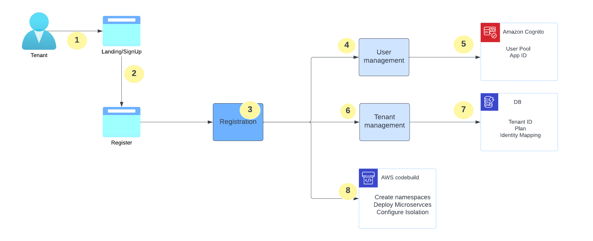
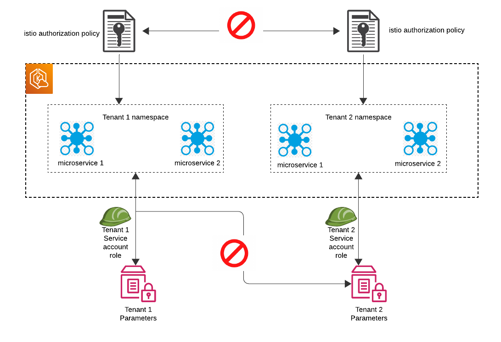
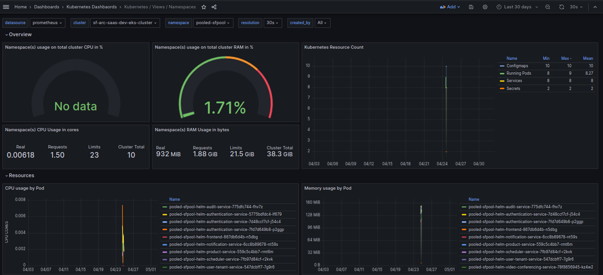
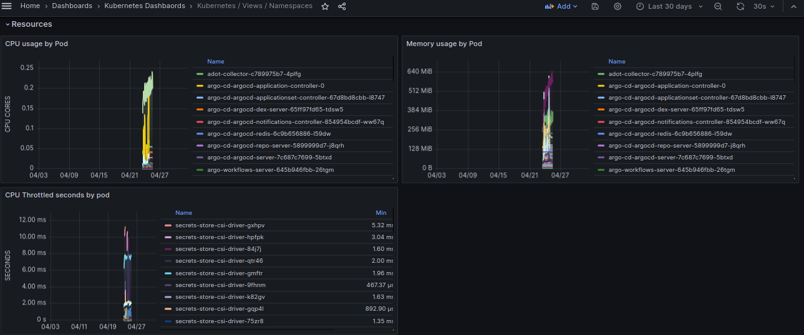
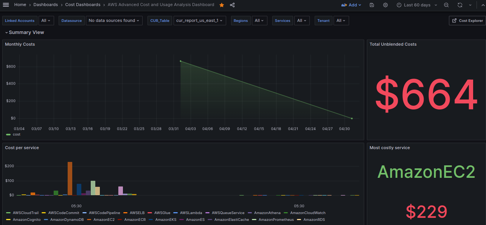
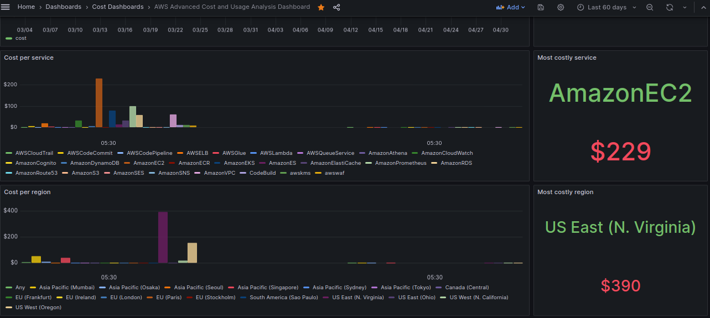
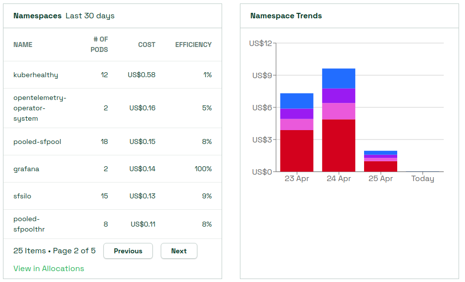
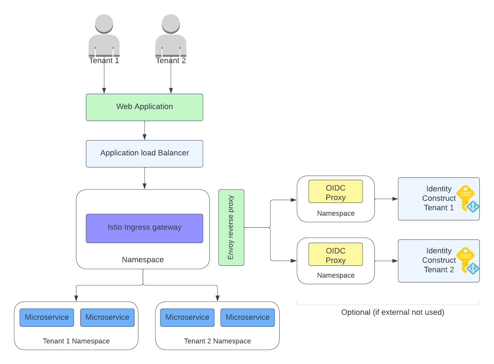
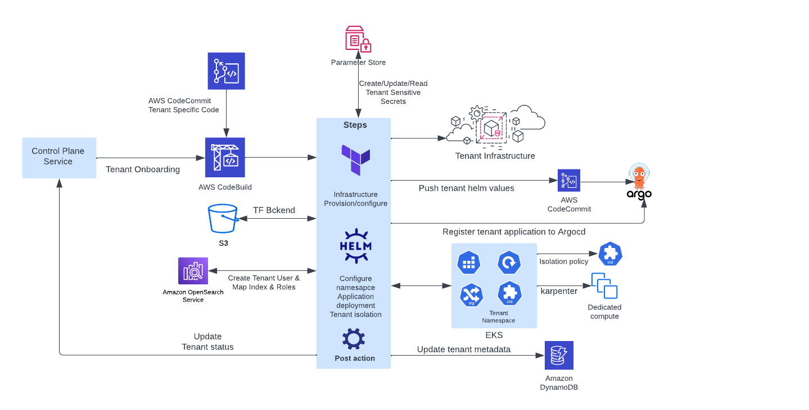

- [Introduction](#introduction)
- [The High-Level Architecture](#the-high-level-architecture)
  - [Tenant Onboarding](#tenant-onboarding)
  - [Tenant Isolation Models](#tenant-isolation-models)
- [AWS Architecture](#aws-architecture)
  - [EKS Cluster](#eks-cluster)
  - [Kubernetes Objects](#kubernetes-objects)
  - [Logging And Monitoring](#logging-and-monitoring)
  - [Billing](#billing)
  - [Control Plane Services](#control-plane-services)
  - [Tenant Provisioning Codebuilds](#tenant-provisioning-codebuilds)
- [Per-tenant Infrastructure](#per-tenant-infrastructure)
  - [Tenant Routing](#tenant-routing)
  - [Tenant Deployment And Management](#tenant-deployment-and-management)
- [Conclusion](#conclusion)
- [Authors](#authors)

## Introduction

SourceFuse Reference Architecture to implement a EKS multi-tenant software-as-a-service (SaaS) solution. The purpose of this document is to give the architecture design specifics that will bring insight to how a Saas solution using **ARC** is structured, organized and works internally. SourceFuse has developed a demonstration EKS SaaS solution aimed at illustrating the key architectural and design principles essential for constructing a multi-tenant SaaS platform on AWS. This example serves as a practical reference for developers and architects seeking to implement best practices in their own projects. The programming model, cost efficiency, security, deployment, and operational attributes of EKS represent a compelling model for SaaS providers.

In the upcoming sections, we'll delve into the mechanics of this multi-tenant SaaS EKS solution setup. We'll dissect the fundamental architectural tactics employed to tackle issues for tenants such as isolation, identity management, data segmentation, routing efficiency, deployment workflows, tenant management and operational complexities inherent in crafting and delivering an EKS-based SaaS solution on AWS. Additionally, we've integrated a tailored observability stack for each tenant, encompassing monitoring and logging functionalities. Furthermore, we'll delve into the billing component of this SaaS solution, leveraging Kubecost and Grafana dashboards for comprehensive insights. This comprehensive exploration aims to furnish you with a hands-on comprehension of the entire system.

This document is intended for developers and architects who have experience on AWS, Terraform. A working knowledge of both Kubernetes and Docker is also helpful. 

## The High-Level Architecture

Before we delve into the specifics of the SaaS EKS solution, let's first examine the overarching elements of the architecture. In Figure 1, you'll find an overview of the foundational layers comprising the SaaS architecture environment.

Figure1 - High-level EKS SaaS Architecture

ARC SaaS architecture consists of two major layers at a high level - 

1. **Control Plane** - The control plane is foundational to any multi-tenant SaaS model. ARC SaaS control plane will include those services that give consumers the ability to manage and operate their tenants through a single, unified experience. Within the control plane, we have 3-tier architecture supporting UI (or some CLI), API and data separately. The core services here represent the collection of services that are used to orchestrate multi-tenant experience. We’ve included some of the common examples of services that are typically part of the core. However, these core services could vary for each SaaS solution depending on the requirements. In the architecture diagram above, we have also shown a separate administration application UI. This represents the application (a web application, a command line interface, or an API) that might be used by a SaaS provider to manage their multi-tenant environment. Please note that the control plane and its services are not actually multi-tenant. These services are global to all tenants and are basically used to operate and manage tenants.

2. **Application Plane** - At the bottom of the diagram, we have represented the application plane of a SaaS environment. This is where the multi-tenant functionality of the actual application will reside. Each tenant will have it's own application plane which will be deployed using helm package manager on EKS cluster.

Control plane services will be used for tenant onboarding and management. 

### Tenant Onboarding

Developing a seamless onboarding process is crucial for any SaaS offering. With EKS SaaS, our aim is to showcase a method for creating a streamlined onboarding experience that automatically handles the setup and deployment of required resources for every new user.

Within this solution, several components are involved in the onboarding procedure. It involves the creation of a fresh tenant and a corresponding user, the customization of the Kubernetes namespace for the tenant, and the deployment of application microservices specific to that tenant. By the conclusion of this process, all infrastructure and multi-tenant policies will be established for your tenants.

Figure2- Tenant Onboarding

Figure2 outlines the onboarding flow. It demonstrates how a new tenant will be onboarded to the multi-tenancy setup. Firstly, tenant will use signup/landing page or SaaS admin/control-plane can register the tenant based on the subscription plan. We have the tenant management service in control plane which will be responsible to update the tenant details in control plane tenant DB. Control access for the tenants will be managed through Amazon cognito. During the Onboarding process, an admin user will be created for each tenant in respective congito user pool. 

Based on the tenant type either it's pool or silo, we have separate codebuild project for provisioning a new tenant. Control plane will trigger the respective codebuild project which will deploy tenant related infrastructure and tenant application plane. As part of the tenant infrastructure, Each tenant will have it's own isolation policies, identity management, monitoring & logging etc. which we will explore in upcoming sections. 

**User Management Service** 

The user management service is used in two separate contexts: one for the SaaS application users and one for the administration application. The sample SaaS actually includes a tenant administration experience that illustrates the natural mechanism that you’d include in your SaaS product to manage your application’s users.

User management plays a more specific role during the onboarding of a new tenant. When a new tenant is created, user management will actually create the Cognito user pool and AppId for that tenant (this is a one-time operation for the tenant). This data is then updated in tenant management and used to support the authentication flow.

The administration application uses a separate user pool for administration users. A SaaS provider can use this application to add, update, and delete administration users.

**Landing Page** 

The landing page is a simple, anonymous sign-up page. It’s representative of our public-facing marketing page through which prospective tenants can sign-up. When you select the sign-up option, you will provide data about your new tenant and submit that information to the system’s registration service. This service will then create and configure all of the resources needed to introduce a new tenant into the system.

As part of this onboarding flow, the system will also send a verification email to the address that was provided during sign-up. The information in this email will allow you to access the system with a temporary password.

### Tenant Isolation Models

In general, SaaS applications can have tenant isolations at two major layers. First, the compute layer (EKS nodes, Lambda functions, etc.).

1. **Pooled Compute** - In case of EKS, pooled compute would mean each tenant will be sharing the same EC2 node on EKS for their backend microservices, but they can have separate namespace. In case of serverless, it would mean each tenant will be sharing the same lambda function per microservice.

2. **Siloed Compute** - In case of EKS, siloed compute would mean each tenant will have its own separate EC2 node on EKS within which all its backend microservices will be deployed. In case of serverless, it would mean each tenant will have its own lambda function deployed per microservice.

The second layer where we can have isolation is at the storage layer (Database, Cache,
Queues, etc.).

1. **Pooled Storage** - All the tenants data will be stored in the same database with logical separation implemented using tenant_id columns in each table in DB.
2. **Siloed Storage** - Each tenant will have its own independent storage unit. It can be a separate schema per tenant (within one database), separate databases per tenant (within one RDS/Aurora), or even separate RDS/Aurora.

As part of ARC SaaS, we will be supporting different multi-tenancy isolation models and its provisioning via control plane.
* Pooled Compute & Pooled Storage
* Siloed Compute & Siloed Storage

In this reference architecture solution, namespaces are used here to create a logical isolation boundary for the different tenants and their resources in an Amazon EKS cluster. We are using a namespace-per-tenant model and use it as a way to divide an EKS cluster’s resources across different tenants as part of the overall tenant isolation model. Once a namespace is created for a tenant, an IAM Role for Service Account is created and associated with the namespace, to further implement isolation strategies to secure the tenant’s application and workloads.

But, namespaces have no intrinsic network boundaries by default, and as a result integrating network policy solutions such as istio authorization policy enable you to achieve network isolation by applying fine-grained network policies at the namespace level.

As part of our overall tenant isolation story, we must also look at isolation is enforced as these tenant microservices attempt to access other resources. In the EKS SaaS solution we have illustrated how isolation is applied as our microservices in tenant namespace, are accessing data.

Figure3- Tenant Isolation

Figure3 descibes two level of different isolation. At the top of the diagram, you’ll see how we’ve attached istio authorization policies which will prevent access to resources in other tenant namespace. Secondly, We have attached service account role to each tenant namespace in the EKS cluster which do not have access to the secrets of other tenant stored in parameter store of system manager. In this way, each tenant can access to specific resources for it's own tenant.

## AWS Architecture

Having grasped the key concepts in motion, let's explore the underlying architecture and observe the tangible architectural elements formed during the setup of the SaaS EKS solution.

In the Figure4, We have described how multi-tenant SaaS solution is deployed on AWS. This infrastructure is comprised of the actual EKS cluster that hosts our service. It also includes the required supporting infrastructure, such as IAM, RDS, WAF, Cognito, S3 buckets, tenant provisioning codebuilds, monitoring and logging tools etc.

The entire solution is built and deployed using terraform infrastructure as a code (IAC). To deploy the each component of the AWS architecture, we have either used ARC IAC terraform modules or we have written the modules to avoid repeatable code.

We have configured codepipeline using terraform to deploy the complete control-plane infrastructure which will also deploy the microservices for control-plane/admin-plane. Please see the README.md file in the root directory of the repository for the rolling out multi-tenant EKS SAAS solution.

Figure4 - AWS Physical EKS SaaS Architecture

The following is a breakdown of the key components of this baseline architecture.

### EKS Cluster

The EKS cluster, along with its corresponding VPC, subnets and NAT Gateways, is deployed via terraform IAC. The terraform scripts deploys a ready-to-use EKS cluster alongwith EKS addons like fluentbit, argocd, argo-workflow, karpenter etc. This cluster runs the pooled and the silo tenant environments of your EKS SaaS solution.

EKS addon helps with logging configuration using fluentbit, managing tenant compute resources using karpenter and tenant application management using argo gitops. We have also configured kuberhealthy operator for synthetic monitoring on EKS cluster.

All new tenant which will be onboarded to the system, will have separate namespace on cluster. Each namespace will have security policy and service account role attached to it.

We have configured istio service mesh for inter-service routing, failure recovery, load balancing and security. Tenant routing will be managed through istio. We have also implemented Kiali to configure, visualize, validate and troubleshoot the istio service mesh.

### Kubernetes Objects

During Control Plane IAC deployment, we also need to configure the Kubernetes objects that needed to support the needs of our SaaS environment. The baseline configuration call uses kubectl to configure and deploy these constructs. This kubernetes objects like istio authorization policy, karpenter nodepool & ec2nodeclass, kuberhealthy health check, virtual service, gateways etc will be deployed using helm package manager. 

We will also register each tenant application with argocd and tenant infrastructure workflow using argo-workflow using kubectl.

### Logging And Monitoring

In a multi-tenant solution, robust monitoring and logging systems are indispensable for maintaining optimal performance, security, and compliance. By implementing tailored monitoring and logging strategies, administrators can ensure the seamless operation of each tenant's environment while safeguarding data integrity and privacy. Effective monitoring enables timely detection of anomalies and performance issues, while comprehensive logging facilitates detailed analysis, troubleshooting, and auditing. In this dynamic landscape, prioritizing monitoring and logging is key to delivering a secure and reliable multi-tenant solution.

Within our architecture, AWS OpenSearch serves as our chosen solution for storing control-plane microservices logs and managing logs on a per-tenant basis. We've implemented a strategy involving the creation of distinct OpenSearch indexes based on Kubernetes namespaces, facilitated by a FluentBit Lua script. Additionally, we're provisioning OpenSearch users and index patterns for each tenant, ensuring strict data isolation. Through dynamic tenant provisioning CodeBuild processes, tenant-specific indexes and users are generated, granting exclusive access to their respective index patterns while preventing access to logs from other tenant namespaces.

In our monitoring setup, our primary tools are Prometheus and Grafana. We've set up Prometheus node-exporter and ADOT collector on the EKS cluster to gather metrics from various namespaces. These metrics are then visualized using Grafana dashboards. Our configuration enables us to visualize API metrics on a per-tenant basis as well. Below are examples of Grafana dashboards illustrating this functionality.

We have added some important dashboards in grafana mentioned below - 

* [AWS Cost Visualization](https://aws.amazon.com/blogs/mt/visualize-and-gain-insights-into-your-aws-cost-and-usage-with-amazon-managed-grafana/)
* [Tenant OnBoarding Deployment measurement](https://grafana.com/grafana/dashboards/11155-aws-codebuild/)
* [Tenat Uptime Visibility using canary](https://grafana.com/grafana/dashboards/13892-aws-cloudwatch-synthetics/)

Figure5 - Grafana Dashboards

### Billing

In a multi-tenant solution, efficient billing mechanisms are essential for accurately tracking resource usage and allocating costs among tenants. By implementing robust billing systems, providers can ensure fair and transparent billing practices while enabling tenants to monitor and manage their usage effectively. Effective billing solutions streamline the invoicing process, provide detailed usage reports, and support flexible pricing models tailored to the diverse needs of tenants

With SaaS, tenants often share some or all of a system’s infrastructure resources. SaaS organizations often rely on some understanding of the cost per tenant as a key element of their broader economic and business model. This cost data can directly influence the pricing dimensions and tiering strategies that are adopted by a SaaS provider. 

In our multi-tenant solution, achieving accurate billing is facilitated through the integration of Kubecost for resource cost monitoring and Cost and Usage Report visualization via Athena. We've configured Grafana dashboards to provide comprehensive insights into AWS costs, including tenant-specific breakdowns. While in a siloed model, calculating per-tenant costs is straightforward due to individual resource allocations, we've leveraged resource tagging to enable filtering for tenant-specific costs within the Cost and Usage Report. This technical approach ensures precise billing granularity and transparency in our multi-tenant environment. 

Here is the flow of billing in our multi-tenant solution- 

Figure6 - Billing

Utilizing Kubecost, we've implemented a methodology to extract cost data per namespace within the EKS cluster, enabling us to ascertain the per-tenant cost of application resources hosted on the cluster. Additionally, within Grafana dashboards, we've incorporated functionality to filter AWS resource costs based on tenant tags. This technical setup ensures precise delineation of costs at both the Kubernetes namespace and AWS resource levels, facilitating granular billing insights in our multi-tenant environment.

Figure7 - Billing Dashboards

### Control Plane Services

Within our control plane infrastructure, we incorporate essential microservices tailored to the functionalities of our EKS SaaS solution. These encompass Audit, Authentication, Tenant Management, Subscription, and User Management microservices, meticulously deployed using Helm package manager alongside Terraform for Infrastructure as Code (IAC). Leveraging DockerHub for image storage, we ensure continuous security scanning to identify and address any potential vulnerabilities. This technical framework underscores the foundation of our control plane, enabling robust and secure service delivery.

### Tenant Provisioning Codebuilds

We've established distinct CodeBuild projects, categorized as premium (featuring siloed compute and storage) and standard (incorporating pooled compute and storage), tailored to different tenant types for provisioning purposes. Each CodeBuild project is associated with its dedicated source, housed within a CodeCommit repository containing tenant-specific Terraform Infrastructure as Code (IAC) and application plane Helm charts. When onboarding a new tenant, the control plane service initiates the respective CodeBuild, orchestrating the provisioning process. Subsequently, upon completion of tenant onboarding, a webhook triggered via CodeBuild relays the provisioning status back to the control plane, ensuring seamless integration and visibility throughout the provisioning lifecycle.

The tenant provisioning CodeBuild processes extend their functionality to include the transmission of tenant-specific data to a DynamoDB table and the registration of tenant applications on ArgoCD. Additionally, they facilitate the transmission of tenant-specific Helm values.yaml files and Terraform tfvars files to a GitOps management repository. This separate repository serves as a centralized hub for managing the lifecycle of tenant infrastructure and application services, enhancing efficiency and control in maintaining the overall environment.

## Per-tenant Infrastructure 

Once the control plane infrastructure is established, the focus shifts towards configuring the necessary infrastructure to accommodate tenants during the onboarding process to the SaaS application. In our chosen architecture, we adopt a namespace-per-tenant model to enforce isolation, necessitating the deployment of distinct resources for each tenant. Below, we delve deeper into this isolation model to explain its technical details.

Upon onboarding a new tenant into the multi-tenant system, its associated infrastructure will be provisioned utilizing Terraform Infrastructure as Code (IAC), while application-level microservices will be deployed via Helm charts in dedicated namespaces within the same cluster. Notably, these microservices and namespaces remain dormant until a tenant is successfully onboarded, ensuring resource allocation is demand-driven. Each tenant is allocated distinct IAM roles and security policies to mitigate potential disruptions from neighboring tenants. Our system accommodates two tenant models with differing characteristics.

1. **Silo Tenant** : Every siloed tenant is allocated exclusive resources encompassing dedicated compute and storage layers, alongside additional components such as a Cognito user pool, Redis ElastiCache etc. Karpenter will provision compute node for silo tenants on the fly. Furthermore, each tenant is provisioned with its distinct application services. Tenant records are systematically registered on Route 53 for streamlined access as subdomain. An administrative user will be instantiated within the Cognito user pool, and its credentials will be disseminated to the designated email address associated with the tenant during the registration process. 

2. **Pooled Tenant** : In the pooled tenant scenario, certain resources are pooled and shared among tenants, including compute nodes, storage databases, Cognito user pools, and Redis ElastiCache instances. However, each pooled tenant is assigned a unique application ID and user within the Cognito user pool. Application services for pooled tenants are deployed on a per-namespace basis, utilizing shared underlying compute resources. 

The SaaS application is equipped with authentication guards, which automatically direct users to the hosted UI if authentication is not detected. Additionally, we've integrated monitoring, logging, and billing functionalities tailored to each tenant. Furthermore, the system dynamically generates tenant-specific OpenSearch users and indexes.

### Tenant Routing

As requests flow from the tenant into each of our microservice, the system must be able to identify the tenant that is associated with each request and route that request to the appropriate tenant namespace. There are multiple ways to address this routing requirement. For the EKS SaaS solution, We have implemented istio service mesh and also configured kiali to Configure, visualize, validate and troubleshoot this service mesh. Kiali is a console for Istio service mesh.

Istio allows you to transparently add capabilities like observability, traffic management, and security. It is configured through terraform only. Istio provides secure service-to-service communication in a cluster with TLS encryption, strong identity-based authentication and authorization, Fine-grained control of traffic behavior with rich routing rules, retries, failovers, and fault injection. 

Figure8 - Tenant Routing

Service mesh uses a proxy to intercept all your network traffic. An Envoy proxy is deployed along with each service that we deploy in cluster. On tenant provisoning, a gateway and a virtual service is deployed as part of kubernetes objects in the EKS cluster.

### Tenant Deployment And Management

Figure9 - Tenant Deployment And management

Figure 9 illustrates the process flow for tenant deployment and management within the multi-tenant SaaS solution. The control plane initiates the CodeBuild process, which orchestrates the provisioning of the tenant. Upon successful onboarding, the infrastructure and application lifecycle of the tenant are managed using tools such as ArgoCD and Argo Workflow. This setup facilitates seamless management of updates to tenant infrastructure and application services. A distinct CodeCommit repository is utilized for housing tenant-specific Helm values and Terraform tfvars files, ensuring organized storage and management of these configuration artifacts.

## Conclusion

This document delved into the foundational components of the Amazon EKS SaaS solution, offering an overview of the key building blocks employed in its construction. It aims to provide a comprehensive understanding of the application's architecture and facilitate efficient navigation of the resources within the repository.

We encourage thorough examination of the codebase and welcome feedback to inform the ongoing evolution of this environment. Anticipating continual enhancements to the solution, we remain committed to addressing emerging strategies and adapting accordingly.

## Authors

This project is authored by below people

- SourceFuse ARC Team

